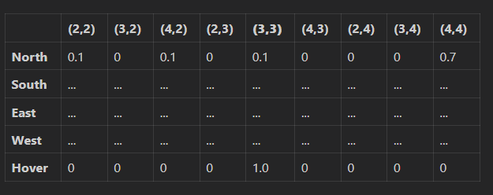
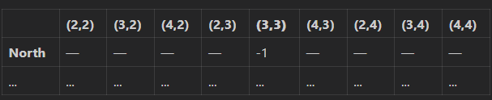
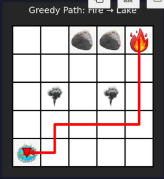
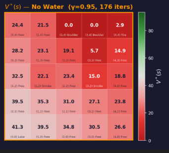

-- Priciple one code should be simple and should seem like not AI generated (And I have comments like keep the very minimal)
-- Please Don't create Anything automatically very file i will create every content i will copy and paste over

## (Repair and re-stuture code)
- Now we will Have agent_related,plot_related,images 3 folders in Rootdir and a Grid_world_final.ipynb

### agent_related
- Has (agent_n_model.py) and the things that file has
    - 1) That file has a class named agent with an intizaizer that takes the tuple of (S,A,P,R,gamma) with types defined as input and checks weather is this is valid or not by summing Proabilites and seing is it equal to 1
    - 2) It should have a fuction called Bellman operator which takes in will take P,R,current V and produces next V next iteration and also output a bool variables saying was it saturated or not
    - 3) It should have a fuction that takes the P,R,V and gives me back Q fuction

### plots related 
- (This folder has many files) (Hear output image means return the image) (For every image that is going to be returned to ipynb to display it should be automatically stored with the a tittle name so it should mandatory for asking title name for the graph by these fuctions)
    - (transition_n_reward_matrices.py) which take input as a point (x,y) and P,R matrices and 2 images like this
        - 
        - 
    - value_fuction_visuvalizer.py (That takes in my value fuction that is of size 50) and output a image that has 2 subplots side by side the first represting states 0-24 that the gird with water = 0 and the second image has 25-49 that is the grid with water = 0
    - optimal_policy_visuvalizer.py has a fuction(Takes in the Q fuction and outputs a images with 2 subplots one represting states 0 to 24 that when water = 0 and the other one when water = 1) and with arrows i need to represent the best direction to move according to the Q(S,A) by going greadily
        - when it comes to the critical states like in first image when water = 0 don't show any arrow for lake (0,0) postion as it the one we are reaching
        - when water = 1 don't show any arrow for fire (4,4) as that is the end postion in that image

    - These are the refernces image for optimal policy you need to have image like this  and have arrows on them like if the opimal step at (3,3) is going to (2,2) the keep the arrow from center of 3,3  to ceneter of (2,2)
    - Note all 24 grid cells need to have a arrow (and if the optimal action comes out to be howering) then instead of arrow just have a dot
    - example of value_function_visvualized_image ()

### Grid_world_final.ipynb
--> Above every cell we will have a markdown note that
#### cell-1 
imports for the entier folder like import all the above files and reload them(Note imports and reloads should happen only in this cell)
#### cell-2
- (Desiging MDP and visualize transition and reward matrices for starting from (3,3))
#### cell-3
-  Run value iteration Visualize the optimal value function and the corresponding policy

#### Remaining plan we will excute slowly